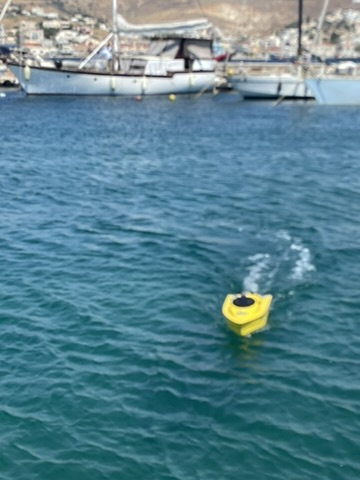

# Autonomous Boat — Summer Project

A collection of code and experiments from my summer 2026 maritime robotics project: exploring autonomous navigation and coordination of small boats.

The project uses **ArduPilot**, **Python/DroneKit**, and **MQTT** to connect boat control with live telemetry. The exercises cover waypoint missions, scout–follower coordination, multi-boat formations, and camera/traffic-based collision handling, with later ROS 2 integration.

## In this repository

- `work/maritime26`: boat parameters, sample mission, and simulation launch scripts.
- `work/lab04-companion`: telemetry and scout/follower exercises.
- `work/lab05-ss`: camera, collision handling, and ROS 2 lab code.
- `work/lab-docker-ss`: Docker setup for the simulation stack.
- `docs`: macOS setup and run guides for Labs 03 and 04.

Start with `docs/lab03-sitl-setup.md` and `docs/lab04-companion-setup.md`. Install ArduPilot separately in `work/ardupilot` and recreate the Python environments described there; generated environments, logs, credentials, and model weights are excluded. Lab 05 camera examples require a separately supplied `models/best.pt`.

## Credits

Based on the University of the Aegean ITSLab maritime summer-school materials: [Lab 04](https://github.com/ITSLab-UAegean/lab04-maritime25), [Lab 05](https://github.com/ITSLab-UAegean/lab05-ss), and [Docker stack](https://github.com/ITSLab-UAegean/lab-docker-ss). Original notices and licenses are retained where supplied. This repository collects the local project snapshot; the upstream lab code is credited to its original authors.
